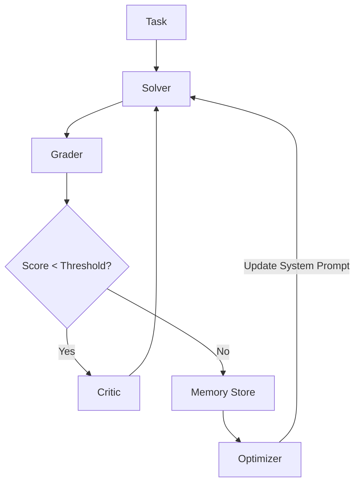

# 🤖 Self-Improving RL Environment

> A multi-agent reinforcement learning system powered by LLMs — where agents solve tasks, receive automated feedback, and **continuously evolve their own logic** through persistent memory and prompt optimization.

Unlike traditional Reinforcement Learning, this system uses **natural language as the action space**, learning by rewriting its own system prompts and building a long-term memory of successful strategies.

---

## 🧠 Core Concept: LLM as an RL Policy

Traditional RL components are mapped directly to LLM interactions:

| Component | RL Definition | LLM Implementation |
|-----------|--------------|-------------------|
| **State** | Environment Snapshot | Task + Memory Context + Attempt History |
| **Action** | Agent Output | The Solver's generated response/solution |
| **Reward** | Numerical Signal | Hybrid Score ($0.0 \rightarrow 1.0$) from Grader |
| **Policy** | Decision Logic | The Solver's System Prompt *(optimized over time)* |

---

## 🏗️ Architecture & Workflow

### The Learning Loop

The system follows a continuous improvement cycle where failures directly inform the next attempt and future strategies.



---

## ⚙️ How It Works

### 1. 💾 Memory Injection
Before attempting a task, the Solver loads:
- **Learned Rules** — e.g., *"Always handle edge cases for math functions"*
- **Prompt Strategies** — Optimized methods for specific task types
- **Historical Context** — Successful patterns from past episodes

### 2. 📊 Hybrid Grading System
Solutions are evaluated through a two-layer process:

| Layer | Weight | What It Checks |
|-------|--------|----------------|
| **Programmatic** | 40% | Syntax, presence of functions, return statements |
| **LLM Evaluation** | 60% | Correctness, logic, and clarity |

### 3. 🔁 The Critic & Retry Loop
If the score is insufficient, the **Critic** analyzes the failure *(e.g., missing edge cases, weak explanation)*. The Solver then retries with the Critic's feedback injected into the context.

### 4. 🧬 Optimization — The Meta-Learning Phase
Every **N episodes** *(default: 5)*, the **Optimizer** analyzes the batch of successes and failures to rewrite the Solver's system prompt.

> **Example Evolution:**
>
> 🔴 **Old Prompt:** `"You are a helpful assistant."`
>
> 🟢 **New Prompt:** `"For coding tasks: Always handle edge cases, include input validation, and explain logic briefly."`

---

## 🧠 Two Modes of Learning

### 🎓 Training Mode *(Taskbank)*
Iterates through a predefined curriculum — **Coding, Math, Reasoning** — to build a baseline of rules and strategies.

### ⚡ User Task Mode *(Real-Time)*
Accepts custom tasks via `env.step(customTask)`. Uses learned memory to solve the task *and* learns from it in real-time, adding it to persistent memory.

---

## ✨ Key Features

| Feature | Description |
|---------|-------------|
| ✅ **Persistent Learning** | Knowledge survives across runs via `agent_memory.json` |
| 🧠 **Self-Rewriting Prompts** | Meta-learning optimizes its own instructions |
| 🔁 **Critic Feedback Loop** | Multi-agent collaboration to fix errors before finalizing |
| 📊 **Detailed Analytics** | Tracks success rates and rewards per category |
| 📦 **Memory Compression** | Condenses raw history into high-level rules |

---

## 🚀 Quick Start

### Installation
```bash
npm install
```

### Run Training Demo
```bash
npm run demo
```

### Launch Web Dashboard
View the Solver thinking, Grader scoring, and Optimizer updates in real-time.
```bash
npm run web
```
> 🌐 Accessible at **http://localhost:3000**

---

## 📁 Project Structure

```
src/
├── env/           # Core RL loop orchestration
├── agents/        # Multi-agent logic (Solver, Critic, Optimizer)
├── memory/        # JSON-based persistent storage system
├── grader/        # Hybrid reward calculation
├── tasks/         # Predefined task curriculum
└── dashboard/     # Web UI components
```

---

## 📊 Monitoring Performance

The system tracks performance through `agent_memory.json`:

- **Task Stats** — Success rates per difficulty and category
- **Global Stats** — Average reward trends and total episodes completed
- **Prompt History** — View how the system prompt has evolved over time

---

## 📄 License

This project is open source. See [LICENSE](LICENSE) for details.
